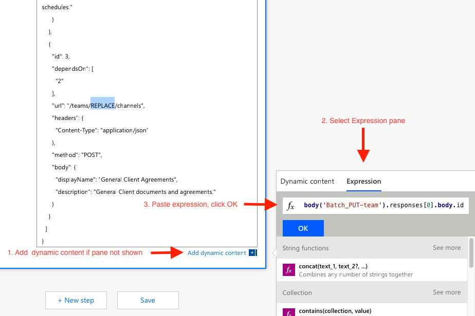
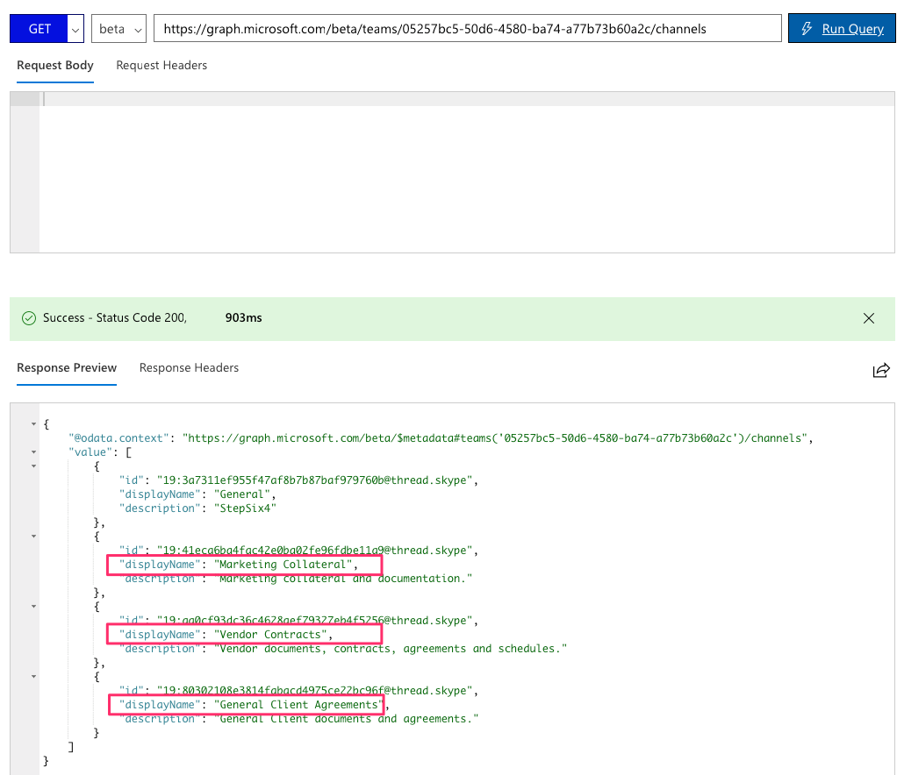

# Create a Microsoft Graph JSON Batch Custom Connector for Microsoft Flow & Logic Apps

## Step 2: Create a Custom Connector to use Microsoft Graph JSON Batching


## Step 3: Authorize the Microsoft Graph JSON Batch custom connector

The final step to ensure our connector is ready for use is to authorize and test the custom connector to create a cached connection.

> [!IMPORTANT]
> The following steps requires that you are logged in with administrator privileges.

1. On the Connector configuration screen, click on the **Test** link (“4 Test”) in the navigation menu
2. Click on **+ New Connection** link
3. Click **Create** and sign in with the Azure Active Directory account


4. Check **Consent on behalf of your organization** and then click **Accept** to Authorize Permissions


5. After permission has been authorized, a Connection will be created in Flow.


The custom connector is now configured and enabled for us to consume the Microsoft Graph JSON Batching methods.  There may be a delay in permissions being applied and available, but the connector is now configured.

## Step 4: Discover JSON Batching capabilities using Microsoft Graph Explorer

Before creating a Flow to consume our new connector, let’s discover some of the capabilities and features of JSON Batching.

1. Open the [Microsoft Graph Explorer](https://developer.microsoft.com/en-us/graph/graph-explorer)
2. Click the **show more samples** link in the left navigation pane
3. Toggle the samples for Batching and Teams to “On”


4.	Select the Batching example to **Perform parallel GETs** in the left menu
5.	Click the **Run Query** button at the top right of the screen.

The sample batch operation batches three (3) HTTP GET requests and issues a single HTTP POST to the /v1.0/$batch Graph endpoint.

```json
{
  "requests": [
    {
      "url": "/me?$select=displayName,jobTitle,userPrincipalName",
      "method": "GET",
      "id": "1"
    },
    {
      "url": "/me/messages?$filter=importance eq 'high'&$select=from,subject,receivedDateTime,bodyPreview",
      "method": "GET",
      "id": "2"
    },
    {
      "url": "/me/events",
      "method": "GET",
      "id": "3"
    }
  ]
}
```

The response returned is shown below.  Note the array of responses that is returned by Microsoft Graph. The responses to the batched requests may appear in a different order. The “id” property should be used to correlate individual batch requests with specific batch responses.


Each response with contain an `id`, `status code`, `headers`, and `error information` if the batch request fails.  To ensure an order of operations for the requests, individual requests can be sequenced using the [dependsOn](https://developer.microsoft.com/en-us/graph/docs/concepts/json_batching#sequencing-requests-with-the-dependson-property) property.

In addition to sequencing and dependency operations, JSON Batching assumes a base path and executes the requests from a relative path. Each batch request element is executed from either the `/v1.0/$batch` OR `/beta/$batch` end points as specified.  This can have significant differences as the `/beta` endpoint may return additional output which may NOT be returned in the `/v1.0` endpoint.

For example, execute the following two queries in the [Microsoft Graph Explorer](https://developer.microsoft.com/en-us/graph/graph-explorer).

1. Query the `/v1.0/$batch` endpoint using the url “/me” (copy and paste request below).

```json
   "requests" : [
        {
          "id": 1,
          "url": "/me",
          "method": "GET"
        }
   ]
```


2. Now query the `/beta/$batch` endpoint url “/me”  with the same request content (copy and paste request below).

```json
   "requests" : [
        {
          "id": 1,
          "url": "/me",
          "method": "GET"
        }
   ]
```


What are the differences in the results returned?   Try some other queries to identify some of the differences.

In addition to different response content from the `/v1.0` and `/beta` endpoints, it is important to understand the possible errors when a batch request is made for which permission consent has not been granted.  For example, the following is a batch request item to create a OneNote Notebook.

```json
   {
      "id": 1,
      "url": "/groups/65c5ecf9-3311-449c-9904-29a2c76b9a50/onenote/notebooks",
      "headers": {
        "Content-Type": "application/json"
      },
      "method": "POST",
      "body": {
        "displayName": "Meeting Notes"
      }
    }
```

However, if the permissions to create OneNote Notebooks has not been granted, the following response is received.  Note the status code 403 (Forbidden) and the error message which indicates the OAuth token provided does not include the scopes required to completed the requested action.

```json
{
  "responses": [
    {
      "id": "1",
      "status": 403,
      "headers": {
        "Cache-Control": "no-cache"
      },
      "body": {
        "error": {
          "code": "40004",
          "message": "The OAuth token provided does not have the necessary scopes to complete the request. Please make sure you are including one or more of the following scopes: Notes.ReadWrite.All,Notes.Read.All (you provided these scopes: Group.Read.All,Group.ReadWrite.All,User.Read,User.Read.All)",
          "innerError": {
            "request-id": "92d50317-aa06-4bd7-b908-c85ee4eff0e9",
            "date": "2018-10-17T02:01:10"
          }
        }
      }
    }
  ]
}
```

Each request in your batch will return a status code and results or error information.  You must process each of the responses in order to determine success or failure of the individual batch operations.

## Step 5: Create a Flow that creates Microsoft Teams using JSON Batching

Now that we understand how to issue JSON batch requests and interpret and correlate the response, our next task is to consume our JSON Batch custom connector using Flow.  The following steps will walk you through creating a Flow to create and configure a Microsoft Team.  The Flow will use a manually triggered Flow.  The Flow will use the custom connector to send a POST request to create an Office 365 Unified Group, will pause for a delay while the group creation completes, and then will send  a PUT request to associate the group with a Microsoft Team.

In the end our Flow will look similar to the following image:


1. Open [Flow](https://flow.microsoft.com) and sign in
2. Click **My Flows** in the top navigation
3. Click **Create from blank**
4. Type `Manual` in the search box and add the **Manually trigger a flow** trigger
5. Click the **+Add an input**, select **Text** and enter `Name` as the title
6. Click **+New step** and type `Batch` in the search box
7. Add the new **MS Graph Batch Connector** action you created
8. Click the ellipsis and rename this action to `Batch POST-groups`
9. Copy the following and paste into the **body** text box of the action

```json
{
  "requests": [
    {
      "url": "/groups",
      "method": "POST",
      "id": 1,
      "headers": { "Content-Type": "application/json" },
      "body": {
        "description": "REPLACE",
        "displayName": "REPLACE",
        "groupTypes": ["Unified"],
        "mailEnabled": true,
        "mailNickname": "REPLACE",
        "securityEnabled": false
      }
    }
  ]
}
```

10. Replace each `REPLACE` placeholder by selecting the `Name` value from the manual trigger from the **Add dynamic content**


11.	Click **+New step**, search for `delay` and add a Delay action and configure for 1 minute.
12. Click **+New step** and type `Batch` in the search box
13. Add the new **MS Graph Batch Connector** action you created again
14.	Rename this second Batch action to `Batch PUT-team`
15. Copy the following and paste into the **body** text box of the action

```json
{
  "requests": [
    {
      "id": 1,
      "url": "/groups/REPLACE/team",
      "method": "PUT",
      "headers": {
        "Content-Type": "application/json"
      },
      "body": {
        "memberSettings": {
          "allowCreateUpdateChannels": true
        },
        "messagingSettings": {
          "allowUserEditMessages": true,
          "allowUserDeleteMessages": true
        },
        "funSettings": {
          "allowGiphy": true,
          "giphyContentRating": "strict"
        }
      }
    }
  ]
}
```

16.	Click `REPLACE` and paste the following formula into the **Expression**:

```json
body('Batch_POST-groups').responses[0].body.id
```


This formula specifies that we want to use the group ID from the result of the first action.


17. Click **Save**, then Flow and click **Test** to execute the Flow.

> [!TIP]
> If you get receive and error resembling the image below, the expression is incorrect and likely references a Flow action it cannot find.  Ensure that the action name you are referencing matches exactly and click **Save** again.


18. Click the **I'll perform the trigger** action radio button and click **Test**

19. Provide a name without spaces, and click **Run flow** to create a Team


20. Finally, click the **See flow run activity link**, then click on the link to your running flow to see your Flow log.

> [!NOTE]
> You may have to click on your running Flow instance in the Run history list to view your Flow execution.

Once the Flow completes, your Office 365 Group and Team have been configured. Click on the Batch action items to view the results of the JSON Batch calls.  The `outputs` of the Batch PUT-team action should have a status code of 201 for a successful Team association similar to the image below.


## Step 6: Extend the Flow to create multiple Channels using JSON Batching

The Flow we just created in Step 5 uses the `$batch` API to make two individual requests to the Microsoft Graph.  Calling the `$batch` endpoint this way provides some benefit and flexibility, but the true power of the `$batch` endpoint comes when executing multiple requests to Microsoft Graph in a single `$batch` call.  Our final step will extend our example of creating a Unified Group and associating a Team to include creating multiple default Channels for the Team. The following steps will  extend the Flow you created in [Step 5](#step-5-create-a-flow-that-creates-microsoft-teams-using-json-batching) to include creating 3 default Channels for the Team in a single `$batch` request.

1. Click **Edit** in the upper right of the Flow result from [Step 5](#step-5-create-a-flow-that-creates-microsoft-teams-using-json-batching)
2. Click **+New step** and type `Batch` in the search box again
3. Add another instance of the **MS Graph Batch Connector** action
4. Click the ellipsis and rename this action to `Batch POST-channels`
5. Copy the following JSON and paste into the **body** text box of the action

```json
{
  "requests": [
    {
      "id": 1,
      "url": "/teams/REPLACE/channels",
      "headers": {
        "Content-Type": "application/json"
      },
      "method": "POST",
      "body": {
        "displayName": "Marketing Collateral",
        "description": "Marketing collateral and documentation."
      }
    },
    {
      "id": 2,
      "dependsOn": [
        "1"
      ],
      "url": "/teams/REPLACE/channels",
      "headers": {
        "Content-Type": "application/json"
      },
      "method": "POST",
      "body": {
        "displayName": "Vendor Contracts",
        "description": "Vendor documents, contracts, agreements and schedules."
      }
    },
    {
      "id": 3,
      "dependsOn": [
        "2"
      ],
      "url": "/teams/REPLACE/channels",
      "headers": {
        "Content-Type": "application/json"
      },
      "method": "POST",
      "body": {
        "displayName": "General Client Agreements",
        "description": "General Client documents and agreements."
      }
    }
  ]
}
```

Notice the three requests above are using the [dependsOn](https://developer.microsoft.com/en-us/graph/docs/concepts/json_batching#sequencing-requests-with-the-dependson-property) property to specify a sequence order, and each will execute a POST request to create a new Channel in our new Team.

6. Click each instance of `REPLACE` in the JSON you just copied and paste the following formula into the **Expression**:

```json
body('Batch_PUT-team').responses[0].body.id
```



7. Click **Save**
8. Click **Test** to execute the Flow.
9. Click the **I'll perform the trigger** action radio button
10. Click **Test**
11. Enter a unique group name in the **Name** field without spaces
12. Click **Run flow** to execute the Flow


13. Once the Flow starts, click the **See flow run activity link**, then click on the link to your running flow to see your Flow log.

When the Flow completes, the final output for the `Batch POST-channels` action will have a 201 HTTP Status response for each Channel created.


Finally, open the [Microsoft Graph Explorer](https://developer.microsoft.com/en-us/graph/graph-explorer) again and paste the following into the query text box.

```text
https://graph.microsoft.com/beta/teams/GROUP_ID/channels
```

Replace the `GROUP_ID` with your new Group's `id` property and click **Run Query**.

> [!TIP]
> You can find the `id` of the new Group by checking the `id` returned in the `Batch POST-groups` actions output in our Flow.

The query should return results similar to the image below with the default **General** channel and the three channels we created using our `$batch` action with 3 requests.



While the above `Batch POST-channels` action was implemented in this lab as a  separate action, the calls to create the channels could have been added as additional calls in the `Batch PUT-team` action.  This would have created the Team and all Channels in a single batch call. Give that a try on your own.

Finally, remember that [JSON Batching](https://developer.microsoft.com/en-us/graph/docs/concepts/json_batching) calls will return an HTTP status code for each request.  In a production process, you may want to combine post processing of the results with an [`Apply to each`](https://docs.microsoft.com/en-us/flow/apply-to-each) action and validate each individual response has a 201 status code or compensate for any other status codes received.