# Create a Microsoft Graph JSON Batch Custom Connector for Microsoft Flow & Logic Apps

There are more than 230 out of box connectors for Microsoft Flow. Many of these connectors use the Microsoft Graph to communicate with specific endpoints of Microsoft products, but there is no connector that communicates directly with the Microsoft Graph to cover the entire API.  There are scenarios where we may need to call the Microsoft Graph directly from Flow using basic building blocks of the service.  

In addition to addressing unique scenarios for calling the Microsoft Graph, a number of Microsoft Graph API endpoints only support [delegated permissions](https://developer.microsoft.com/en-us/graph/docs/concepts/permissions_reference).  The HTTP connector in Microsoft Flow enables very flexible integrations, including calling the Microsoft Graph. However, the HTTP connector lacks the capability of caching a user's credentials to enable specific delegated permission scenarios.  In these cases, a custom connector can be created to provide a wrapper around the Microsoft Graph API and enable consuming the API with delegated permissions

This lab covers creating a custom connector to enable integrations with Microsoft Graph which require [delegated permissions](https://developer.microsoft.com/en-us/graph/docs/concepts/permissions_reference), specifically using [the $batch request endpoint](https://developer.microsoft.com/en-us/graph/docs/concepts/json_batching), to provide access to the full power of the Microsoft Graph while using the delegated permissions that require an app to have a “signed-in” user present.  

> [!NOTE]
> This topic is a tutorial on creating a custom connector for use in Microsoft Flow and Azure LogicApps.  This article assumes you have read the [custom connector overview](https://docs.microsoft.com/en-us/connectors/custom-connectors/) to understand the process.

## In this Lab

* [Step 1 - Create an Azure AD application registration](#step-1-create-an-azure-ad-application-registration )
* [Step 2: Create a Custom Connector to use Microsoft Graph JSON Batching](#step-2-create-a-custom-connector-to-use-microsoft-graph-json-batching)
* [Step 3: Authorize the Microsoft Graph JSON Batch custom connector](#step-3-authorize-the-microsoft-graph-json-batch-custom-connector)
* [Step 4: Discover JSON Batching capabilities using Microsoft Graph Explorer](#step-4-discover-json-batching-capabilities-using-microsoft-graph-explorer)
* [Step 5: Create a Flow that creates Microsoft Teams using JSON Batching](#step-5-create-a-flow-that-creates-microsoft-teams-using-json-batching)

## Prerequisites

To complete this exercise in this post you will need the following:

* Administrator access to an Office 365 tenancy.
  * If you do not have one, visit the [Office 365 Developer Program](https://developer.microsoft.com/en-us/office/dev-program) to sign up of a FREE developer tenant.
* Access to [Microsoft Flow](https://flow.microsoft.com/).

## Step 1: Create an Azure AD application registration

This step will create a new Azure Active Directory Application which will be used to provide the delegated permissions for the custom connector.  

1. Open a browser and navigate to https://aad.portal.azure.com
2. Click the **Azure Active Directory** link in the left navigation menu
3. Click on the **App registrations** entry on the **Manage** section of the App Registrations blade

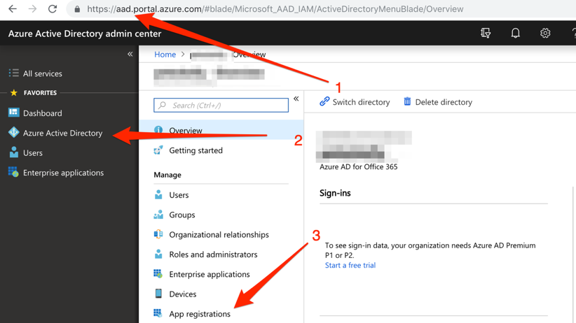

4. Click the **New application registration** menu item at the top of the App Registrations blade


5. Enter ``MS Graph Batch App`` in the **Name** field for the name of the application
6. Enter https://localhost.com/$batch for the Sign-on URL
7. Click **Create** at the bottom of the blade

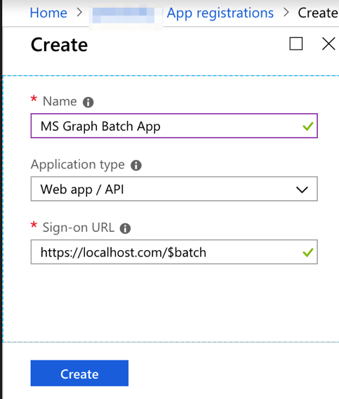

8. On the Registered App page, click the **Settings** gear under the application name
9. Copy the **Application ID** of the application, and save for Step 2


10. Click on the **Required Permissions** menu item in the Settings blade
11. Click **Add** at the top of the Required Permissions blade

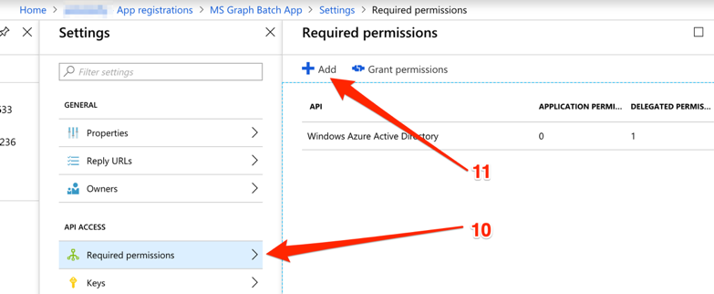

12. Click the **Select API** option in the Add API Access blade
13. In the Select an API blade, click the **Microsoft Graph** item
14. Click **Select** at the bottom of the blade  


15. On the **Enable Access** blade, scroll down to the Delegated Permissions section
16. Select the **Read and write all groups** delegated permissions
17. Click **Select** at the bottom of the blade
18. Click **Done** at the bottom of the Add API access blade

 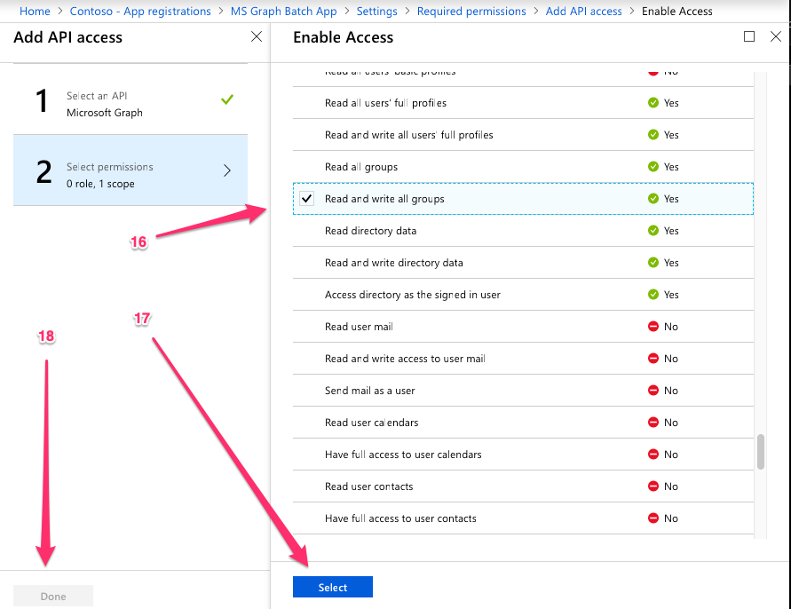
 
19.	Click the **Keys** menu item on the Settings blade
20.	Enter `forever` in the **Key description** and select **Never expires** from the Duration drop down menu
21.	Click **Save** at the top of the Keys blade
22.	Copy the key value for the new key and save for Step 2.  


> [!IMPORTANT]
> This step is critical as the key will not be accessible once you close this blade. Save this key to a text editor for use in upcoming steps.

To enable management of additional service accessible via the Microsoft Graph, including Teams properties, you would need to select additional, appropriate scopes to enable for managing specific services.  For example, to extend our solution to enable creating OneNote Notebooks or Planner plans, buckets and tasks you would need to add additional permission scopes.

## Step 2: Create a Custom Connector to use Microsoft Graph JSON Batching

This step will create a new custom connector which can be used in Flow or in Azure Logic Apps.  The Open API definition file (formerly a Swagger file) is prebuilt with the correct path for the Microsoft Graph $batch endpoint and additional settings to enable simple import.

1. Open the the [MSGraph-Delegate-Batch.swagger.json](./LabFiles/MSGraph-Delegate-Batch.swagger.json) file.
    1. Click on the Raw button
    2. Copy the file contents
    3. Save the content to a local file named MSGraph-Delegate-Batch.swagger.json
2. Open a browser and navigate to https://flow.microsoft.com
3. Click the gear icon in the upper right
4. Select the **Custom Connectors** item in the drop-down menu

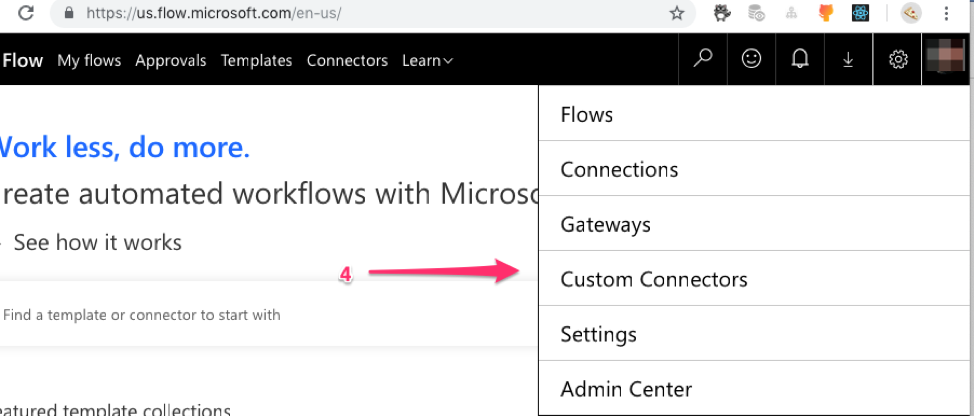

5. On the Custom Connectors screen click the **+Create Custom Connector** link in the top right
6. Select the **Import and Open API file** item in the drop-down menu

 

7.	Enter `MS Graph Batch Connector` in the **Custom connector name** text box
8.	Click the folder icon to upload the Open API file
9.	Browse to the local MSGraph-Delegate-Batch.swagger.json file you downloaded previously
10.	Click Continue to upload the connector file
 
 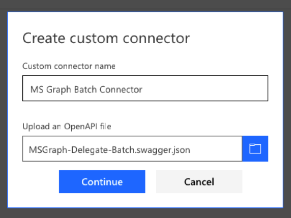

11.	On the Connector configuration screen, click on the **Security** link in the navigation menu  
12.	Enter in the **Client Id**  (Application Id copied in Step 1.9 above)
13.	Enter the **Client secret** from above ((Application key copied in Step 1.22 above)
14.	Enter https://graph.microsoft.com (no trailing /) as the **Resource URL** (sometimes also known as Audience)
15.	Click **Create Connector** on the top-right
 
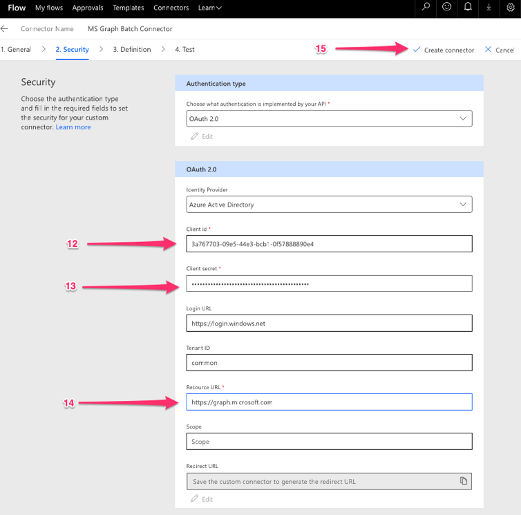

16.	After the connector has been created, copy the generated **Redirect URL** 

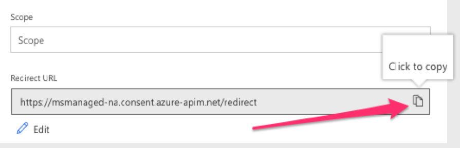

17. Go back to https://aad.portal.azure.com under the registered application, and add the **Redirect Url** you copied as an additional Reply URL to the App registration.
18. Save the application in Azure Active Directory portal.
 


## Step 3: Authorize the Microsoft Graph JSON Batch custom connector

The final step to ensure our connector is ready for use is to authorize and test the custom connector to create a cached connection.

> [!IMPORTANT]
> The following steps requires that you are logged in with administrator privileges.

1. On the Connector configuration screen, click on the **Test** link (“4 Test”) in the navigation menu
2. Click on **+ New Connection** link
3. Click **Create** and sign in with the Azure Active Directory account

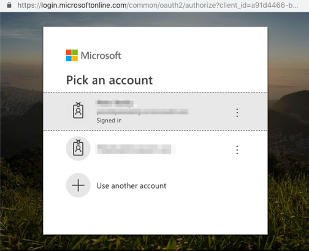

4. Check **Consent on behalf of your organization** and then click **Accept** to Authorize Permissions

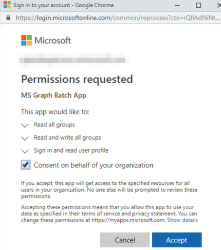

5. After permission has been authorized, a Connection will be created in Flow.


The custom connector is now configured and enabled for us to consume the Microsoft Graph JSON Batching methods.  There may be a delay in permissions being applied and available, but the connector is now configured.

## Step 4: Discover JSON Batching capabilities using Microsoft Graph Explorer

Before creating a Flow to consume our new connector, let’s discover some of the capabilities and features of JSON Batching.  

1. Open the [Microsoft Graph Explorer](https://developer.microsoft.com/en-us/graph/graph-explorer)
2. Click the **show more samples** link in the left navigation pane
3. Toggle the samples for Batching and Teams to “On”


4.	Select the Batching example to **Perform parallel GETs** in the left menu
5.	Click the **Run Query** button at the top right of the screen.

The sample batch operation batches three (3) HTTP GET requests and issues a single HTTP POST to the /v1.0/$batch Graph endpoint.

```json  
{
  "requests": [
    {
      "url": "/me?$select=displayName,jobTitle,userPrincipalName",
      "method": "GET",
      "id": "1"
    },
    {
      "url": "/me/messages?$filter=importance eq 'high'&$select=from,subject,receivedDateTime,bodyPreview",
      "method": "GET",
      "id": "2"
    },
    {
      "url": "/me/events",
      "method": "GET",
      "id": "3"
    }
  ]
}
```

The response returned is shown below.  Note the array of responses that is returned by Microsoft Graph. The responses to the batched requests may appear in a different order. The “id” property should be used to correlate individual batch requests with specific batch responses.  


Each response with contain an `id`, `status code`, `headers`, and `error information` if the batch request fails.  To ensure an order of operations for the requests, individual requests can be sequenced using the [dependsOn](https://developer.microsoft.com/en-us/graph/docs/concepts/json_batching#sequencing-requests-with-the-dependson-property) property.

In addition to sequencing and dependency operations, JSON Batching assumes a base path and executes the requests from a relative path. Each batch request element is executed from either the `/v1.0/$batch` OR `/beta/$batch` end points as specified.  This can have significant differences as the `/beta` endpoint may return additional output which may NOT be returned in the `/v1.0` endpoint.  

For example, execute the following two queries in the [Microsoft Graph Explorer](https://developer.microsoft.com/en-us/graph/graph-explorer).

1. Query the `/v1.0/$batch` endpoint using the url “/me” (copy and paste request below).

```json
   "requests" : [
        {
          "id": 1,
          "url": "/me",
          "method": "GET"
        }
   ]
```


2. Now query the `/beta/$batch` endpoint url “/me”  with the same request content (copy and paste request below).

```json
   "requests" : [
        {
          "id": 1,
          "url": "/me",
          "method": "GET"
        }
   ]
```

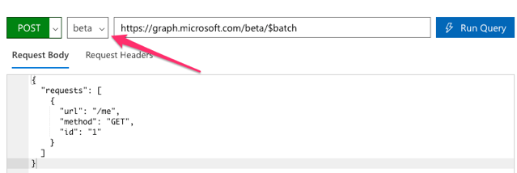

What are the differences in the results returned?   Try some other queries to identify some of the differences.

In addition to different response content from the `/v1.0` and `/beta` endpoints, it is important to understand the possible errors when a batch request is made for which permission consent has not been granted.  For example, the following is a batch request item to create a OneNote Notebook.

```json 
   {
      "id": 1,
      "url": "/groups/65c5ecf9-3311-449c-9904-29a2c76b9a50/onenote/notebooks",
      "headers": {
        "Content-Type": "application/json"
      },
      "method": "POST",
      "body": {
        "displayName": "Meeting Notes"
      }
    }
```

However, if the permissions to create OneNote Notebooks has not been granted, the following response is received.  Note the status code 403 (Forbidden) and the error message which indicates the OAuth token provided does not include the scopes required to completed the requested action.

```json
{
  "responses": [
    {
      "id": "1",
      "status": 403,
      "headers": {
        "Cache-Control": "no-cache"
      },
      "body": {
        "error": {
          "code": "40004",
          "message": "The OAuth token provided does not have the necessary scopes to complete the request. Please make sure you are including one or more of the following scopes: Notes.ReadWrite.All,Notes.Read.All (you provided these scopes: Group.Read.All,Group.ReadWrite.All,User.Read,User.Read.All)",
          "innerError": {
            "request-id": "92d50317-aa06-4bd7-b908-c85ee4eff0e9",
            "date": "2018-10-17T02:01:10"
          }
        }
      }
    }
  ]
}
```

Each request in your batch will return a status code and results or error information.  You must process each of the responses in order to determine success or failure of the individual batch operations.  

## Step 5: Create a Flow that creates Microsoft Teams using JSON Batching

Now that we understand how to issue JSON batch requests and interpret and correlate the response, our final task is to consume our JSON Batch custom connector using Flow.  The following steps will walk you through creating a Flow to create and configure a Microsoft Team.  The Flow will use a manually triggered Flow.  The Flow will use the custom connector to send a POST request to create an Office 365 Unified Group, will pause for a delay while the group creation completes, and then will send  a PUT request to associate the group with a Microsoft Team.

In the end our Flow will look similar to the following image:  

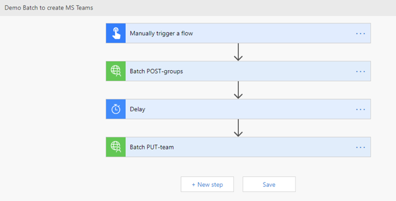

1. Open [Flow](https://flow.microsoft.com) and sign in
2. Click **My Flows** in the top navigation
3. Click **Create from blank**
4. Type `Manual` in the search box and add the **Manually trigger a flow** trigger
5. Click the **+Add an input**, select **Text** and enter `Name` as the title
6. Click **+New step** and type `Batch` in the search box
7. Add the new **MS Graph Batch Connector** action you created
8. Click the ellipsis and rename this action to `Batch POST-groups`
9. Copy the following and paste into the **body** text box of the action

```json 
{
  "requests": [
    {
      "url": "/groups",
      "method": "POST",
      "id": 1,
      "headers": { "Content-Type": "application/json" },
      "body": {
        "description": "REPLACE",
        "displayName": "REPLACE",
        "groupTypes": ["Unified"],
        "mailEnabled": true,
        "mailNickname": "REPLACE",
        "securityEnabled": false
      }
    }
  ]
}
```

10. Replace each `REPLACE` placeholder by selecting the `Name` value from the manual trigger from the **Add dynamic content**

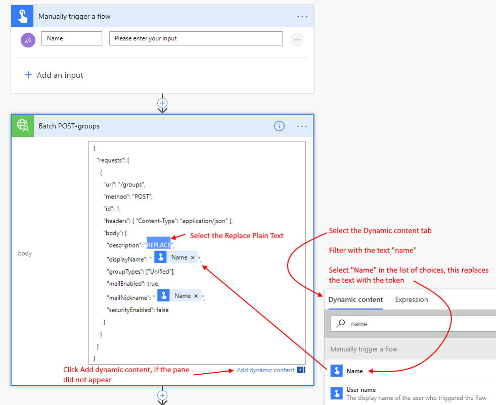

11.	Click **+New action**, search for `delay` and add a Delay action and configure for 1 minute.
12. Click **+New step** and type `Batch` in the search box
13. Add the new **MS Graph Batch Connector** action you created again
14.	Rename this second Batch action to `Batch PUT-team`
15. Copy the following and paste into the **body** text box of the action

```json
{
  "requests": [
    {
      "url": "/groups/REPLACE/team",
      "method": "PUT",
      "id": 1,
      "headers": {
        "Content-Type": "application/json"
      },
      "body": {
        "memberSettings": {
          "allowCreateUpdateChannels": true
        },
        "messagingSettings": {
          "allowUserEditMessages": true,
          "allowUserDeleteMessages": true
        },
        "funSettings": {
          "allowGiphy": true,
          "giphyContentRating": "strict"
        }
      }
    }
  ]
}
```

16.	Click `REPLACE` and paste the following formula into the **Expression**:

```json
body('Batch_POST-groups').responses[0].body.id
```

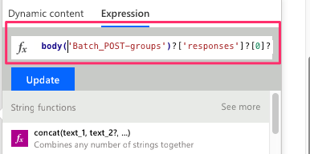

This formula specifies that we want to use the group ID from the result of the first action.

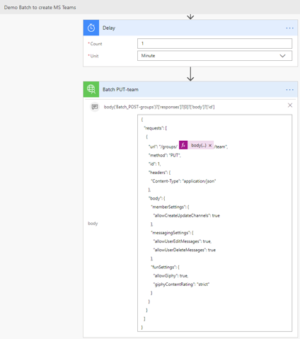

17. Click **Save**, then Flow and click **Test** to execute the Flow.

> [!TIP]
> If you get receive and error resembling the image below, the expression is incorrect and likely references a Flow action it cannot find.  Ensure that the action name you are referencing matches exactly and click **Save** again.

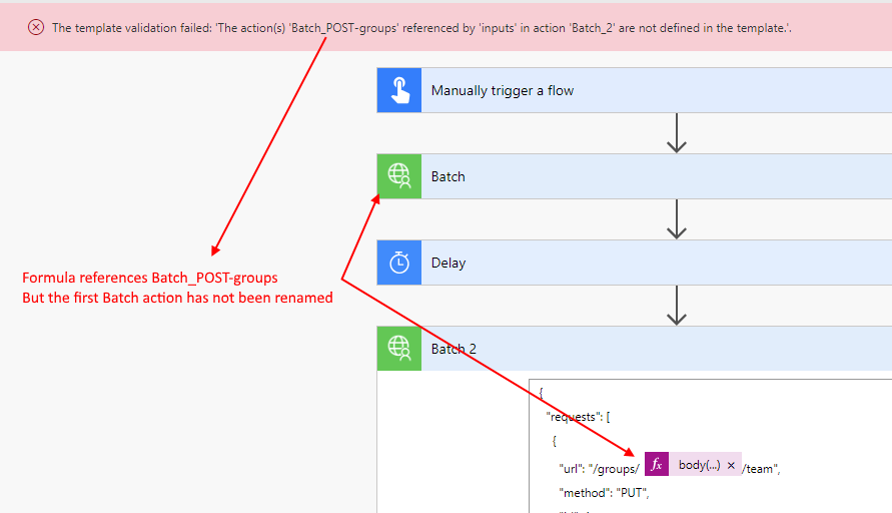

> [!TIP]
> If you get receive and error resembling the image below, the expression is incorrect and likely references a Flow action it cannot find.  Ensure that the action name you are referencing matches exactly and click **Save** again.


18. Click the **I'll perform the trigger** action radio button and click **Test**

19. Provide a name without spaces, and click **Run** to create a Team


20. Finally. click the **See flow run activity link**, then click on the link to your running flow to see your Flow log.

Once the Flow completes, your Office 365 Group and Team have been configured. Click on the Batch action items to view the results of the JSON Batch calls.


