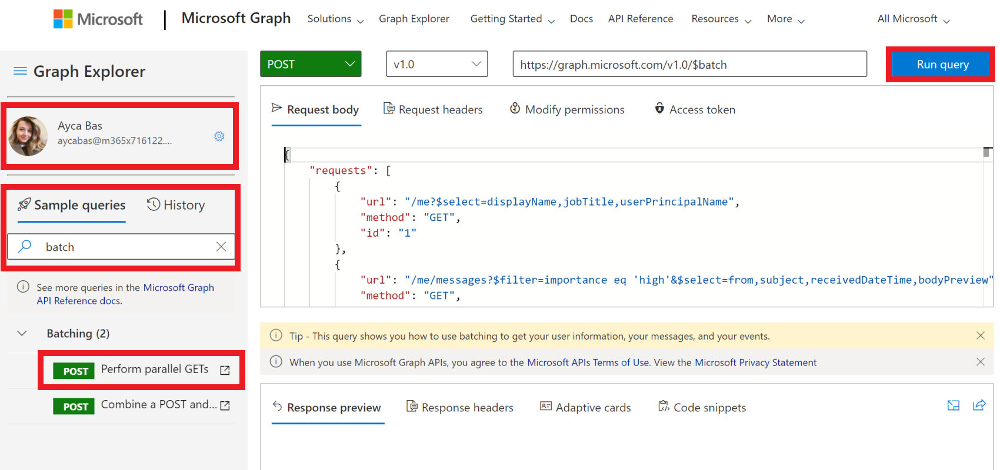
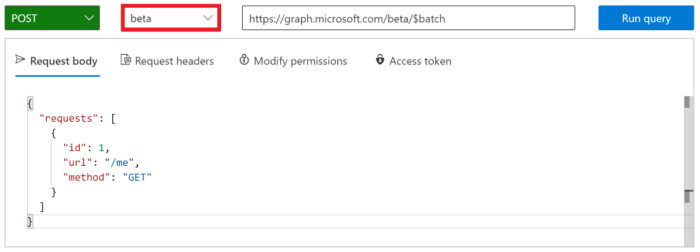

<!-- markdownlint-disable MD002 MD041 -->

Before creating a Flow to consume the new connector, use [Microsoft Graph Explorer](https://developer.microsoft.com/graph/graph-explorer) to discover some of the capabilities and features of JSON batching in Microsoft Graph.

Open the [Microsoft Graph Explorer](https://developer.microsoft.com/graph/graph-explorer) in your browser. Sign in with your Office 365 tenant administrator account. Search for for **Batch** from the **Sample queries**.

Select the **Perform parallel GETs** sample query in the left menu. Choose the **Run Query** button at the top right of the screen.



The sample batch operation batches three HTTP GET requests and issues a single HTTP POST to the `/v1.0/$batch` Graph endpoint.

```json
{
    "requests": [
        {
            "url": "/me?$select=displayName,jobTitle,userPrincipalName",
            "method": "GET",
            "id": "1"
        },
        {
            "url": "/me/messages?$filter=importance eq 'high'&$select=from,subject,receivedDateTime,bodyPreview",
            "method": "GET",
            "id": "2"
        },
        {
            "url": "/me/events",
            "method": "GET",
            "id": "3"
        }
    ]
}
```

The response returned is shown below. Note the array of responses that is returned by Microsoft Graph. The responses to the batched requests may appear in a different order than the order of the requests in the POST. The `id` property should be used to correlate individual batch requests with specific batch responses.

> [!NOTE]
> The response has been truncated for readability.

```json
{
  "responses": [
    {
      "id": "1",
      "status": 200,
      "headers": {...},
      "body": {...}
    },
    {
      "id": "3",
      "status": 200,
      "headers": {...},
      "body": {...}
    }
    {
      "id": "2",
      "status": 200,
      "headers": {...},
      "body": {...}
    }
  ]
}
```

Each response contains an `id`, `status`, `headers`, and `body` property. If the `status` property for a request indicates a failure, the `body` contains any error information returned from the request.

To ensure an order of operations for the requests, individual requests can be sequenced using the [dependsOn](https://docs.microsoft.com/graph/json-batching#sequencing-requests-with-the-dependson-property) property.

In addition to sequencing and dependency operations, JSON batching assumes a base path and executes the requests from a relative path. Each batch request element is executed from either the `/v1.0/$batch` OR `/beta/$batch` endpoints as specified. This can have significant differences as the `/beta` endpoint may return additional output which may NOT be returned in the `/v1.0` endpoint.

For example, execute the following two queries in the [Microsoft Graph Explorer](https://developer.microsoft.com/graph/graph-explorer).

1. Query the `/v1.0/$batch` endpoint using the url `/me` (copy and paste request below).

```json
{
  "requests": [
    {
      "id": 1,
      "url": "/me",
      "method": "GET"
    }
  ]
}
```


Now use the version selector drop-down to change to the `beta` endpoint, and make the exact same request.



What are the differences in the results returned? Try some other queries to identify some of the differences.

In addition to different response content from the `/v1.0` and `/beta` endpoints, it is important to understand the possible errors when a batch request is made for which permission consent has not been granted. For example, the following is a batch request item to create a OneNote Notebook.

```json
{
  "id": 1,
  "url": "/groups/65c5ecf9-3311-449c-9904-29a2c76b9a50/onenote/notebooks",
  "headers": {
    "Content-Type": "application/json"
  },
  "method": "POST",
  "body": {
    "displayName": "Meeting Notes"
  }
}
```

However, if the permissions to create OneNote Notebooks has not been granted, the following response is received. Note the status code `403 (Forbidden)` and the error message which indicates the OAuth token provided does not include the scopes required to completed the requested action.

```json
{
  "responses": [
    {
      "id": "1",
      "status": 403,
      "headers": {
        "Cache-Control": "no-cache"
      },
      "body": {
        "error": {
          "code": "40004",
          "message": "The OAuth token provided does not have the necessary scopes to complete the request.
            Please make sure you are including one or more of the following scopes: Notes.ReadWrite.All,
            Notes.Read.All (you provided these scopes: Group.Read.All,Group.ReadWrite.All,User.Read,User.Read.All)",
          "innerError": {
            "request-id": "92d50317-aa06-4bd7-b908-c85ee4eff0e9",
            "date": "2018-10-17T02:01:10"
          }
        }
      }
    }
  ]
}
```

Each request in your batch will return a status code and results or error information. You must process each of the responses in order to determine success or failure of the individual batch operations.
