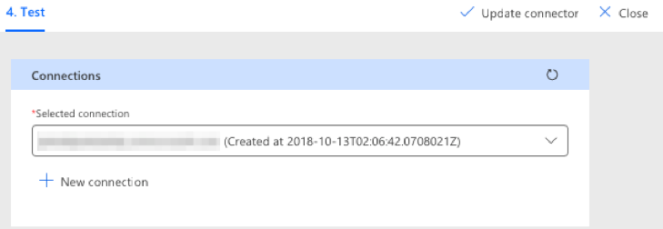

<!-- markdownlint-disable MD002 MD041 -->

The final configuration step to ensure the connector is ready for use is to authorize and test the custom connector to create a cached connection.

> [!IMPORTANT]
> The following steps requires that you are logged in with administrator privileges.

In [Microsoft Power Automate](https://flow.microsoft.com), go to the Connector configuration screen and choose the **Test** link in the navigation menu. Choose the **New Connection** link. Sign in with your Office 365 tenant administrator's Azure Active Directory account.

When prompted for the requested permissions, check **Consent on behalf of your organization** and then choose **Accept** to authorize permissions.

After you authorize the permissions, a connection is created in Flow.

The custom connector is now configured and enabled. There may be a delay in permissions being applied and available, but the connector is now configured.
