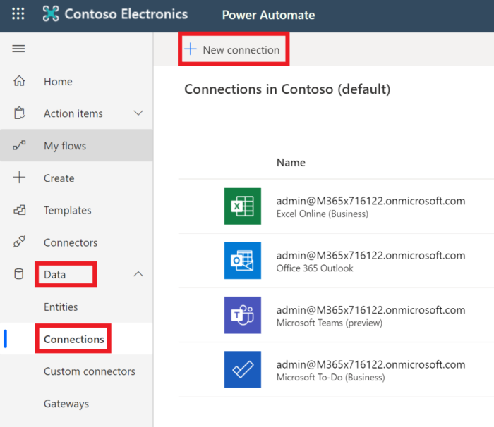
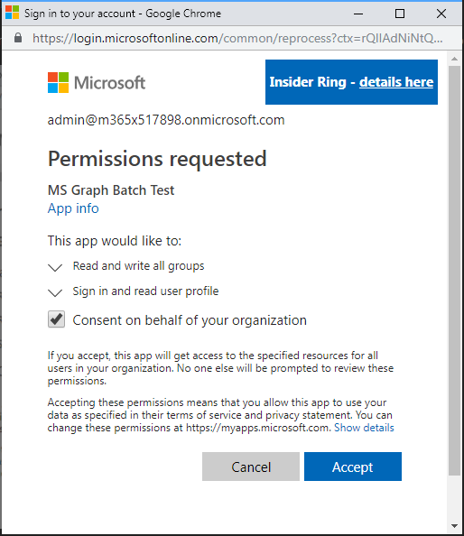

<!-- markdownlint-disable MD002 MD041 -->

The final configuration step to ensure the connector is ready for use is to authorize and test the custom connector to create a cached connection.

> [!IMPORTANT]
> The following steps requires that you are logged in with administrator privileges.

In [Microsoft Power Automate](https://flow.microsoft.com), go to the **Data** menu item on the left and choose the **Connections** page. Choose the **New Connection** link.

Find your custom connector and complete the connection by clicking the plus button. Sign in with your Office 365 tenant administrator's Azure Active Directory account.

When prompted for the requested permissions, check **Consent on behalf of your organization** and then choose **Accept** to authorize permissions.

After you authorize the permissions, a connection is created in Power Automate.

The custom connector is now configured and enabled. There may be a delay in permissions being applied and available, but the connector is now configured.
