<!-- markdownlint-disable MD002 MD041 -->

In this exercise, you will create a new custom connector which can be used in Microsoft Power Automate or in Azure Logic Apps. The Open API definition file is prebuilt with the correct path for the Microsoft Graph `$batch` endpoint and additional settings to enable simple import.

There are two options to create a custom connector for Microsoft Graph:

- Create from blank
- Import an OpenAPI file

## Option 1: Create custom connector from blank template

Open a browser and navigate to [Microsoft Power Automate](https://flow.microsoft.com). Sign in with your Office 365 tenant administrator account. Choose **Data** on the left-hand side menu, and select the **Custom Connectors** item in the drop-down menu.

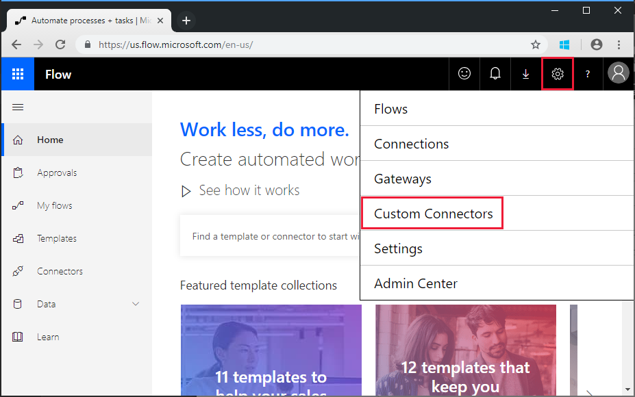

On the **Custom Connectors** page choose the **Create custom connector** link in the top right, then select the **Create from blank** item in the drop-down menu.

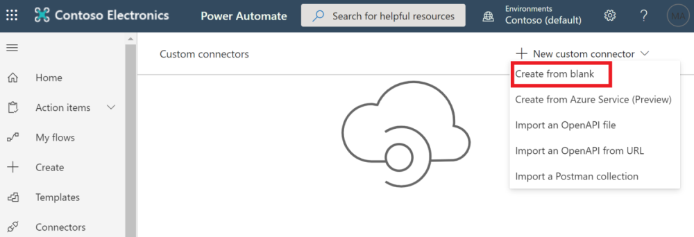

Enter `MS Graph Batch Connector` in the **Custom connector name** text box. Choose **Continue**.

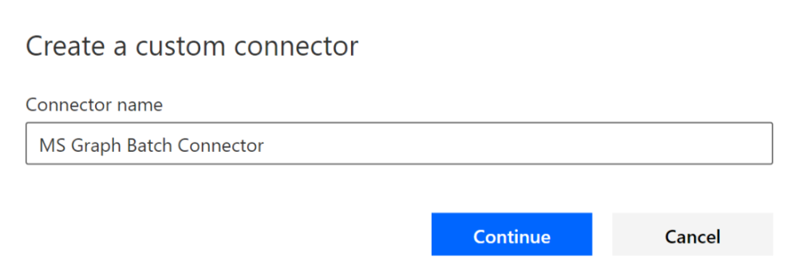

On the connector configuration **General** page, fill in the fields as follows.

- **Scheme**: HTTPS
- **Host**: `graph.microsoft.com`
- **Base URL**: `/`

Choose **Security** button to continue.

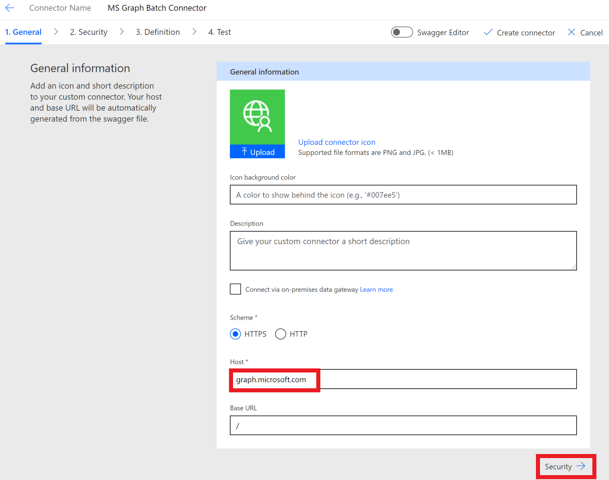

On the **Security** page, fill in the fields as follows.

- **Choose what authentication is implemented by your API**: `OAuth 2.0`
- **Identity Provider**: `Azure Active Directory`
- **Client id**: the application ID you created in the previous exercise
- **Client secret**: the key you created in the previous exercise
- **Login url**: `https://login.windows.net`
- **Tenant ID**: `common`
- **Resource URL**: `https://graph.microsoft.com` (no trailing /)
- **Scope**: Leave blank

Choose **Definition** button to continue.

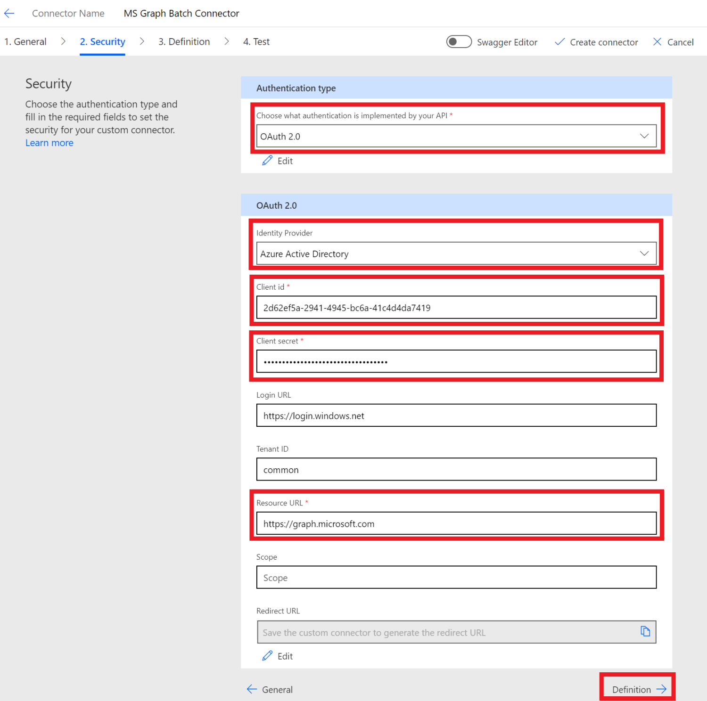

On the **Definition** page, select **New Action** and fill in the fields as follows.

- **Summary**: `Batch`
- **Description**: `Execute Batch with Delegate Permission`
- **Operation ID**: `Batch`
- **Visibility**: `important`

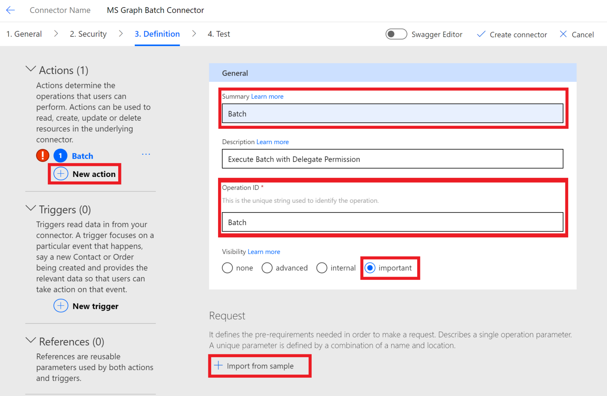

Create **Request** bt selecting **Import from Sample** and fill in the fields as follows.

- **Verb**: `POST`
- **URL**: `https://graph.microsoft.com/beta/$batch`
- **Headers**: Leave blank
- **Body**: `{}`

Select **Import**.

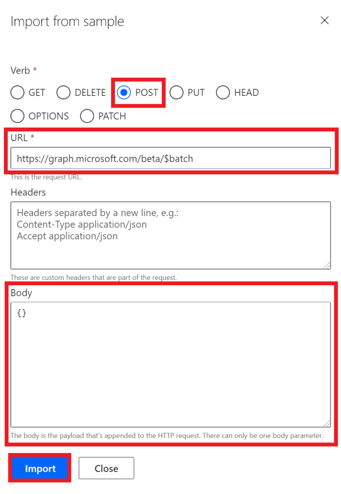

Choose **Create Connector** on the top-right.

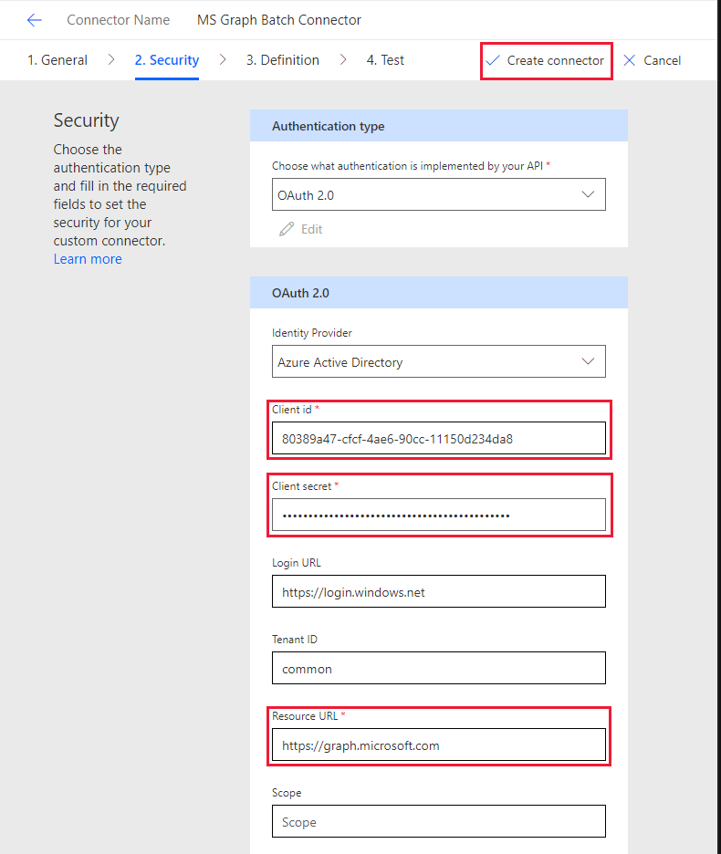

After the connector has been created, copy the generated **Redirect URL** from **Security** page.

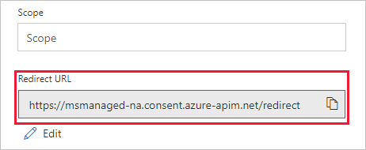

Go back to the registered application in the [Azure Portal](https://aad.portal.azure.com) you created in the previous exercise. Select **Authentication** on the left-hand side menu. Select **Add URI** and add the **Redirect URL** you copied in the **Redirect URIs** under **Web**. Save the application in Azure Active Directory portal.

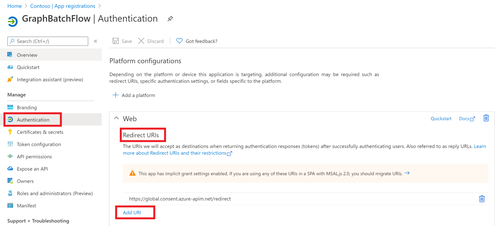

## Option 2: Create custom connector by importing OpenAPI file

Using a text editor, create a new empty file named `MSGraph-Delegate-Batch.swagger.json` and add the following code.

[!code-json]

Open a browser and navigate to [Microsoft Power Automate](https://flow.microsoft.com). Sign in with your Office 365 tenant administrator account. Choose **Data** on the left-hand side menu, and select the **Custom Connectors** item in the drop-down menu.

On the **Custom Connectors** page choose the **Create custom connector** link in the top right, then select the **Import an Open API file** item in the drop-down menu.

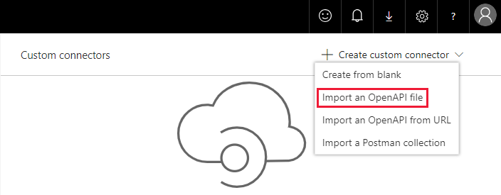

Enter `MS Graph Batch Connector` in the **Custom connector name** text box. Choose the folder icon to upload the Open API file. Browse to the `MSGraph-Delegate-Batch.swagger.json` file you created. Choose **Continue** to upload the Open API file.

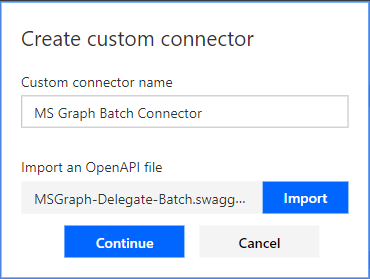

On the connector configuration page, choose the **Security** link in the navigation menu. Fill in the fields as follows.

- **Choose what authentication is implemented by your API**: `OAuth 2.0`
- **Identity Provider**: `Azure Active Directory`
- **Client id**: the application ID you created in the previous exercise
- **Client secret**: the key you created in the previous exercise
- **Login url**: `https://login.windows.net`
- **Tenant ID**: `common`
- **Resource URL**: `https://graph.microsoft.com` (no trailing /)
- **Scope**: Leave blank

Choose **Create Connector** on the top-right

After the connector has been created, copy the generated **Redirect URL**.

Go back to the registered application in the [Azure Portal](https://aad.portal.azure.com) you created in the previous exercise. Select **Authentication** on the left-hand side menu. Select **Add URI** and add the **Redirect URL** you copied in the **Redirect URIs** under **Web**. Save the application in Azure Active Directory portal.

