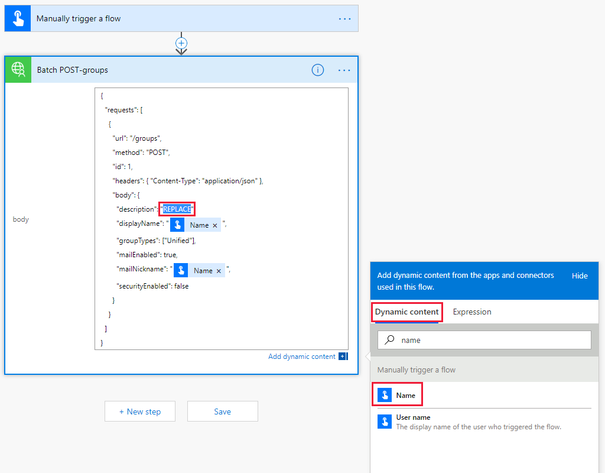
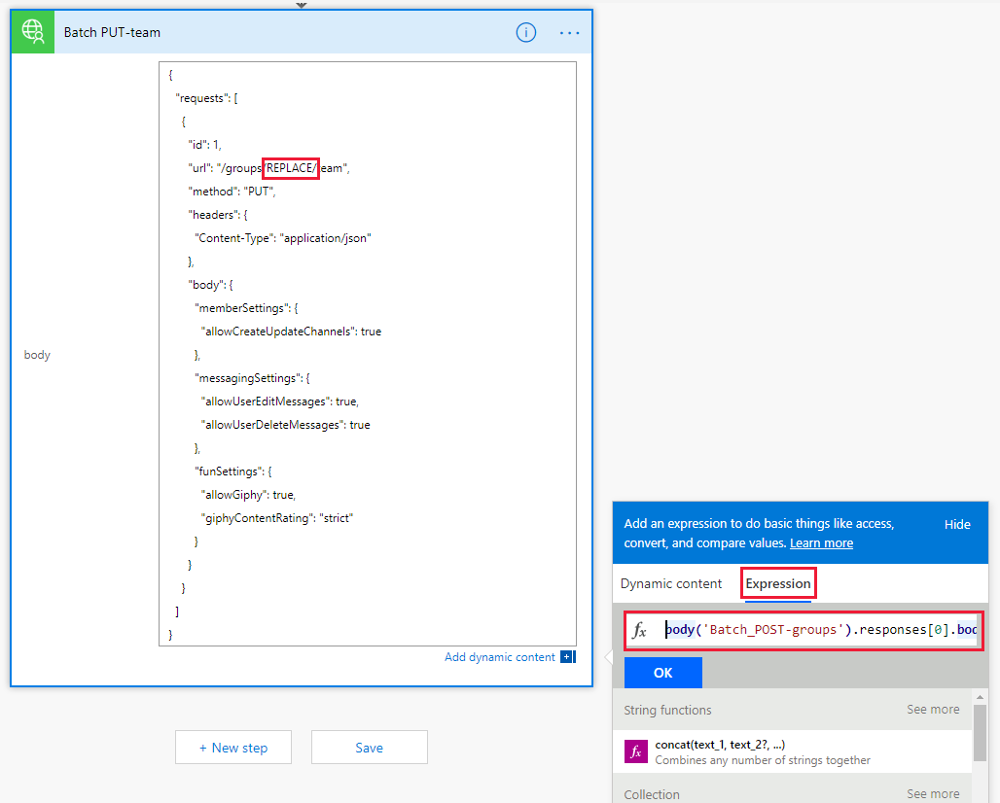
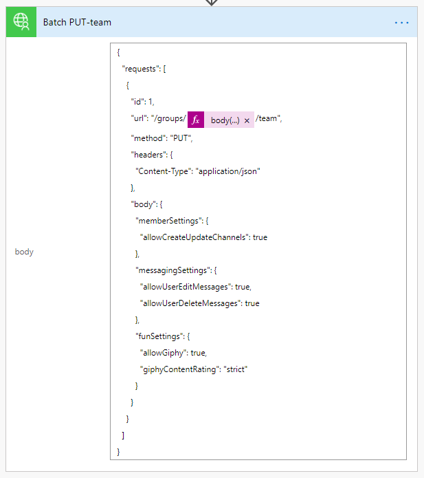
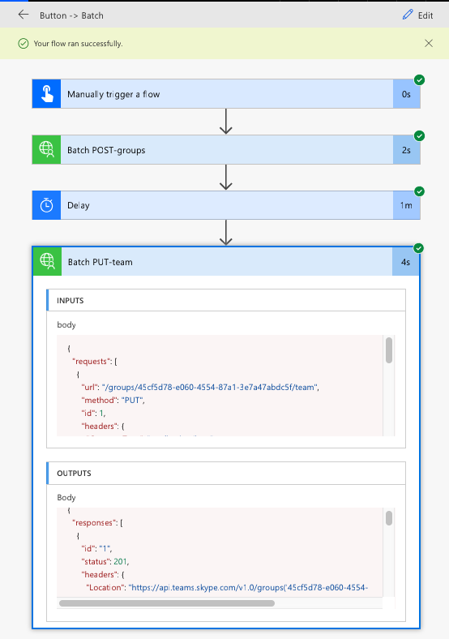

<!-- markdownlint-disable MD002 MD041 -->

In this exercise, you will create a Flow to use the custom connector you created in previous exercises to create and configure a Microsoft Team. The Flow will use the custom connector to send a POST request to create an Office 365 Unified Group, will pause for a delay while the group creation completes, and then will send a PUT request to associate the group with a Microsoft Team.

In the end your Flow will look similar to the following image:


Open [Microsoft Flow](https://flow.microsoft.com) in your browser and sign in with your Office 365 tenant administrator account. Choose **My Flows** in the left-hand navigation. Choose **New**, then **Create from blank**. Choose **Create from blank**. Enter `Manual` in the search box and add the **Manually trigger a flow** trigger.

Choose **Add an input**, select **Text** and enter `Name` as the title.


Choose **New step** and type `Batch` in the search box. Add the **MS Graph Batch Connector** action. Choose the ellipsis and rename this action to `Batch POST-groups`.

Add the following code into the **body** text box of the action.

```json
{
  "requests": [
    {
      "url": "/groups",
      "method": "POST",
      "id": 1,
      "headers": { "Content-Type": "application/json" },
      "body": {
        "description": "REPLACE",
        "displayName": "REPLACE",
        "groupTypes": ["Unified"],
        "mailEnabled": true,
        "mailNickname": "REPLACE",
        "securityEnabled": false
      }
    }
  ]
}
```

Replace each `REPLACE` placeholder by selecting the `Name` value from the manual trigger from the **Add dynamic content** menu.



Choose **New step**, search for `delay` and add a **Delay** action and configure for 1 minute.

Choose **New step** and type `Batch` in the search box. Add the **MS Graph Batch Connector** action. Choose the ellipsis and rename this action to `Batch PUT-team`.

Add the following code into the **body** text box of the action.

```json
{
  "requests": [
    {
      "id": 1,
      "url": "/groups/REPLACE/team",
      "method": "PUT",
      "headers": {
        "Content-Type": "application/json"
      },
      "body": {
        "memberSettings": {
          "allowCreateUpdateChannels": true
        },
        "messagingSettings": {
          "allowUserEditMessages": true,
          "allowUserDeleteMessages": true
        },
        "funSettings": {
          "allowGiphy": true,
          "giphyContentRating": "strict"
        }
      }
    }
  ]
}
```

Select the `REPLACE` placeholder, then select **Expression** in the dynamic content pane. Add the following formula into the **Expression**.

```js
body('Batch_POST-groups').responses[0].body.id
```



This formula specifies that we want to use the group ID from the result of the first action.



Choose **Save**, then Flow and choose **Test** to execute the Flow.

> [!TIP]
> If you receive an error like `The template validation failed: 'The action(s) 'Batch_POST-groups' referenced by 'inputs' in action 'Batch_2' are not defined in the template'`, the expression is incorrect and likely references a Flow action it cannot find. Ensure that the action name you are referencing matches exactly.

Choose the **I'll perform the trigger** action radio button and choose **Save & Test**. Choose **Continue** in the dialog. Provide a name without spaces, and choose **Run flow** to create a Team.


Finally, choose the **See flow run activity** link, then select the running Flow to see the activity log.

> [!NOTE]
> You may have to click on your running Flow instance in the Run history list to view your Flow execution.

Once the Flow completes, your Office 365 Group and Team have been configured. Select the Batch action items to view the results of the JSON Batch calls. The `outputs` of the `Batch PUT-team` action should have a status code of 201 for a successful Team association similar to the image below.

