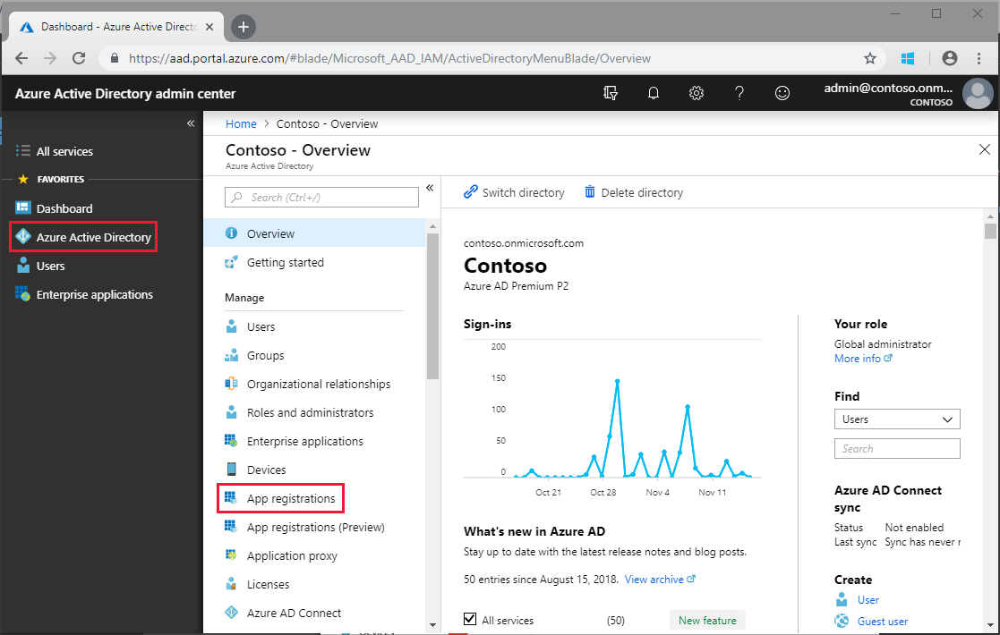
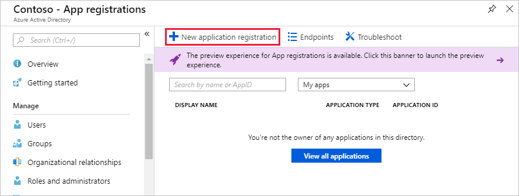
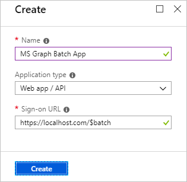
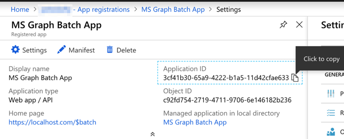
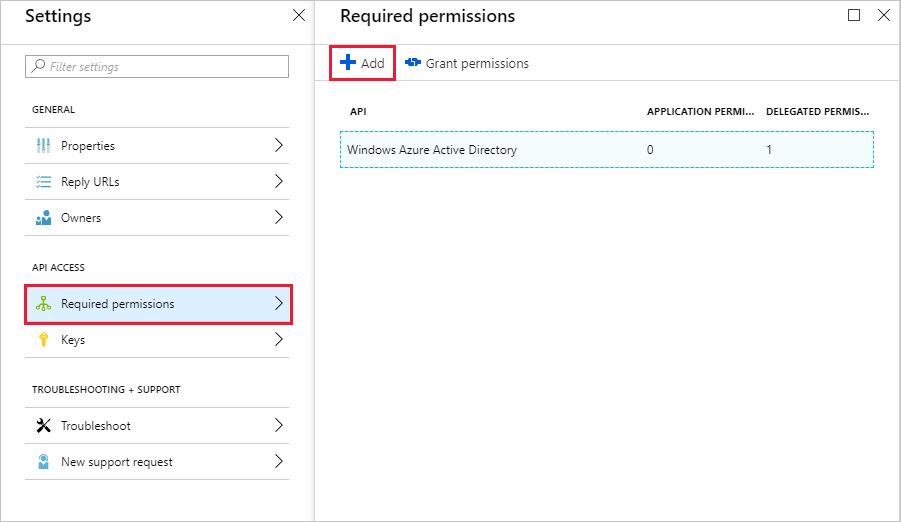
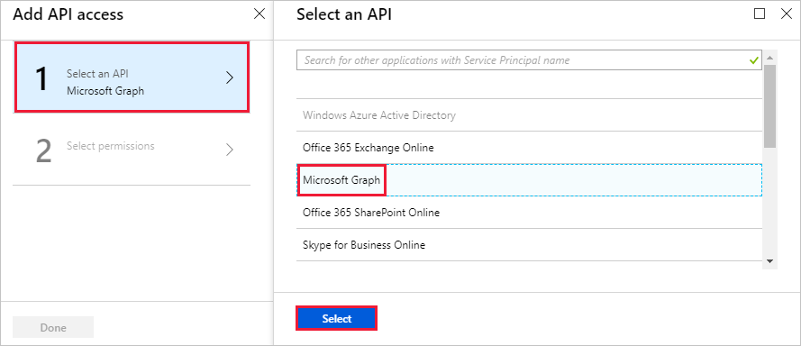
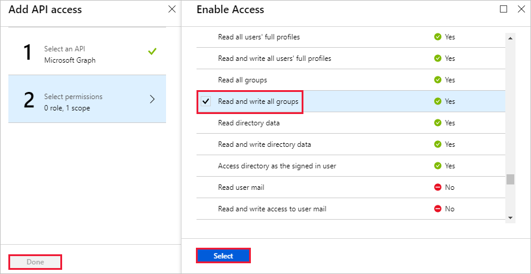

<!-- markdownlint-disable MD002 MD041 -->

In this exercise, you will create a new Azure Active Directory Application which will be used to provide the delegated permissions for the custom connector.

Open a browser and navigate to [Azure Active Directory admin center](https://aad.portal.azure.com). Choose the **Azure Active Directory** link in the left navigation menu, then choose the **App registrations** entry in the **Manage** section of the **Azure Active Directory** blade.

Choose the **New application registration** menu item at the top of the **App Registrations** blade.

Enter `MS Graph Batch App` in the **Name** field, and `https://localhost.com/$batch` in the **Sign-on URL** field and choose **Create**.

On the **MS Graph Batch App** page, copy the **Application ID** of the application. You'll need this in the next exercise.

Choose the **Settings** gear under the application name, then choose the **Required Permissions** menu item in the Settings blade. Choose **Add** at the top of the **Required Permissions** blade.

Choose the **Select an API** option in the **Add API access** blade, then select the **Microsoft Graph** item and choose **Select** at the bottom of the blade.

On the **Enable Access** blade, scroll down to the **Delegated Permissions** section. Select the **Read and write all groups** delegated permission, then choose **Select** at the bottom of the blade. Choose **Done** at the bottom of the **Add API access** blade.

 

Choose the **Keys** menu item on the **Settings** blade. Enter `forever` in the **Key description** and select **Never expires** from the **Duration** drop down menu. Choose **Save** at the top of the **Keys** blade. Copy the key value for the new key. You'll need this in the next exercise.

> [!IMPORTANT]
> This step is critical as the key will not be accessible once you close this blade. Save this key to a text editor for use in upcoming exercises.

To enable management of additional services accessible via the Microsoft Graph, including Teams properties, you would need to select additional, appropriate scopes to enable managing specific services. For example, to extend our solution to enable creating OneNote Notebooks or Planner plans, buckets and tasks you would need to add the required permission scopes for the relevant APIs.
