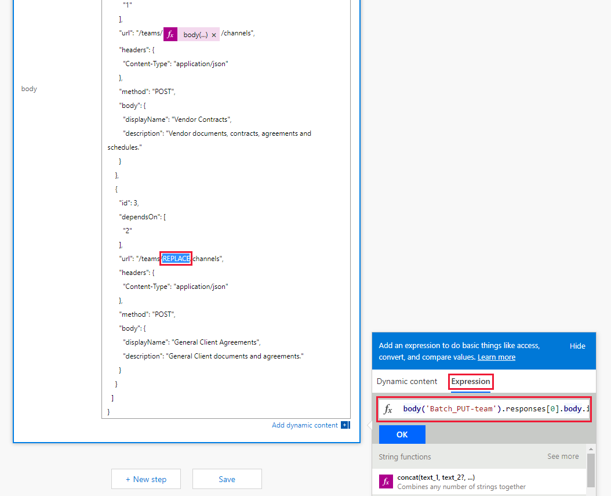
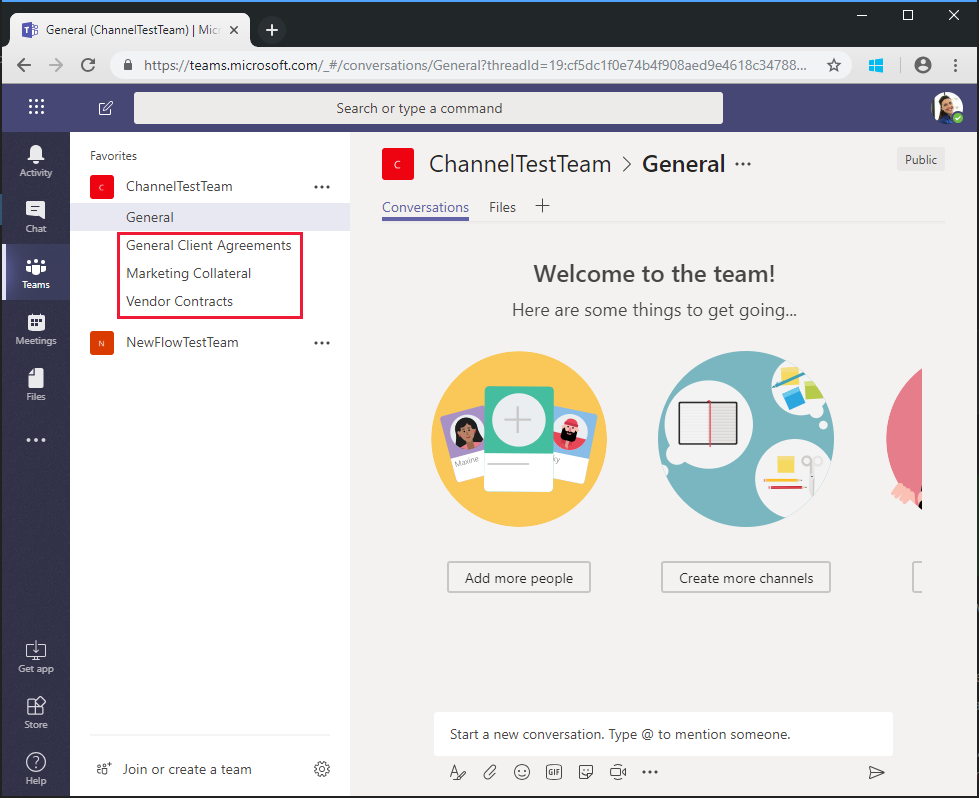

<!-- markdownlint-disable MD002 MD041 -->

The Flow you created in the previous exercise uses the `$batch` API to make two individual requests to the Microsoft Graph. Calling the `$batch` endpoint this way provides some benefit and flexibility, but the true power of the `$batch` endpoint comes when executing multiple requests to Microsoft Graph in a single `$batch` call. In this exercise, you will extend the example of creating a Unified Group and associating a Team to include creating multiple default Channels for the Team in a single `$batch` request.

Open [Microsoft Power Automate](https://flow.microsoft.com) in your browser and sign in with your Office 365 tenant administrator account. Select the Flow you created in the previous step and choose **Edit**.

Choose **New step** and type `Batch` in the search box. Add the **MS Graph Batch Connector** action. Choose the ellipsis and rename this action to `Batch POST-channels`.

Add the following code into the **body** text box of the action.

```json
{
  "requests": [
    {
      "id": 1,
      "url": "/teams/REPLACE/channels",
      "headers": {
        "Content-Type": "application/json"
      },
      "method": "POST",
      "body": {
        "displayName": "Marketing Collateral",
        "description": "Marketing collateral and documentation."
      }
    },
    {
      "id": 2,
      "dependsOn": [
        "1"
      ],
      "url": "/teams/REPLACE/channels",
      "headers": {
        "Content-Type": "application/json"
      },
      "method": "POST",
      "body": {
        "displayName": "Vendor Contracts",
        "description": "Vendor documents, contracts, agreements and schedules."
      }
    },
    {
      "id": 3,
      "dependsOn": [
        "2"
      ],
      "url": "/teams/REPLACE/channels",
      "headers": {
        "Content-Type": "application/json"
      },
      "method": "POST",
      "body": {
        "displayName": "General Client Agreements",
        "description": "General Client documents and agreements."
      }
    }
  ]
}
```

Notice the three requests above are using the [dependsOn](https://docs.microsoft.com/graph/json-batching#sequencing-requests-with-the-dependson-property) property to specify a sequence order, and each will execute a POST request to create a new channel in the new Team.

Select each instance of the `REPLACE` placeholder, then select **Expression** in the dynamic content pane. Add the following formula into the **Expression**.

```js
body('Batch_PUT-team').responses[0].body.id
```



Choose **Save**, then choose **Test** to execute the Flow. Select the **I'll perform the trigger** action radio button, then choose **Save & Test**. Enter a unique group name in the **Name** field without spaces, and choose **Run flow** to execute the Flow.

Once the Flow starts, choose the **Done** button to see the activity log. When the Flow completes, the final output for the `Batch POST-channels` action has a 201 HTTP Status response for each Channel created.


Browse to [Microsoft Teams](https://teams.microsoft.com) and sign in with your Office 365 tenant administrator account. Verify that the team you just created appears and includes the three channels created by the `$batch` request.



While the above `Batch POST-channels` action was implemented in this tutorial as a separate action, the calls to create the channels could have been added as additional calls in the `Batch PUT-team` action. This would have created the Team and all Channels in a single batch call. Give that a try on your own.

Finally, remember that [JSON Batching](https://docs.microsoft.com/graph/json-batching) calls will return an HTTP status code for each request. In a production process, you may want to combine post processing of the results with an [`Apply to each`](https://docs.microsoft.com/power-automate/apply-to-each) action and validate each individual response has a 201 status code or compensate for any other status codes received.
